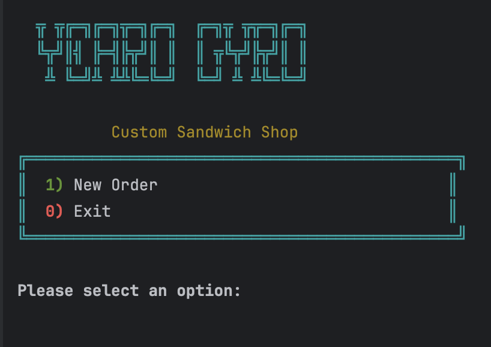
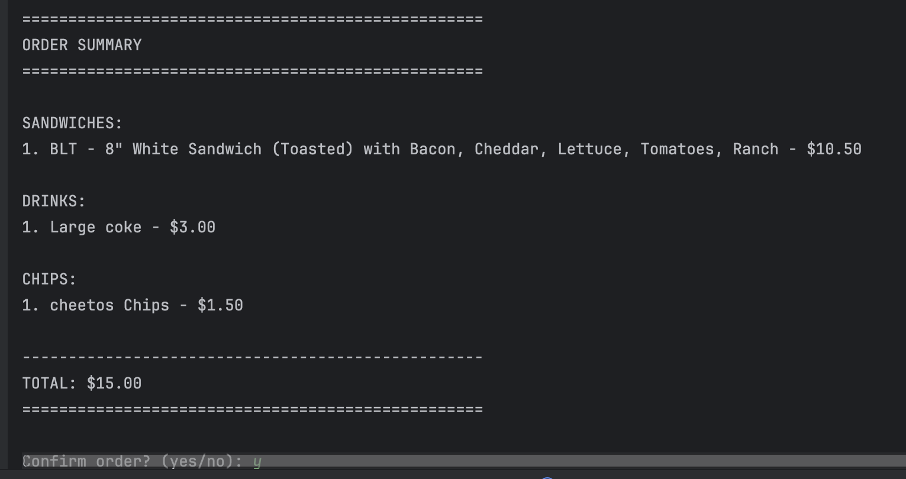
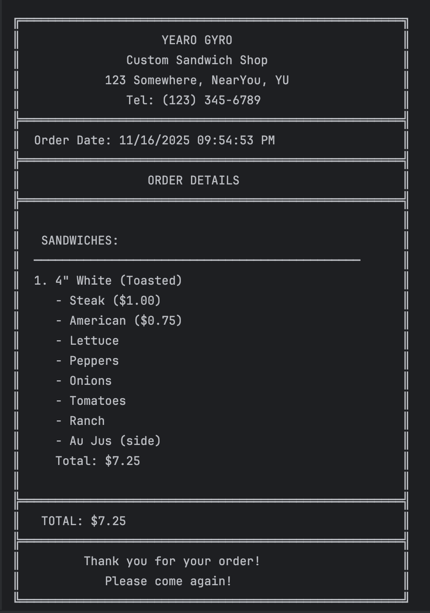
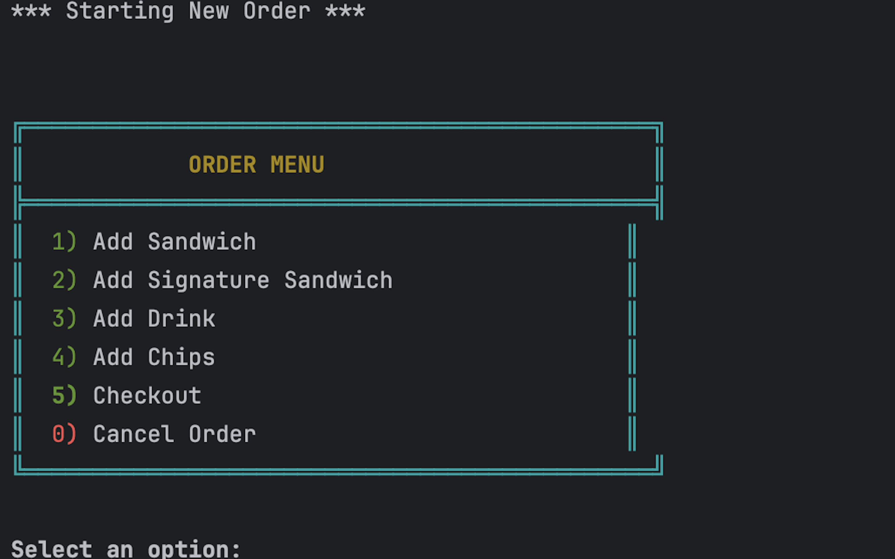
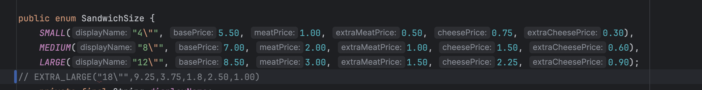
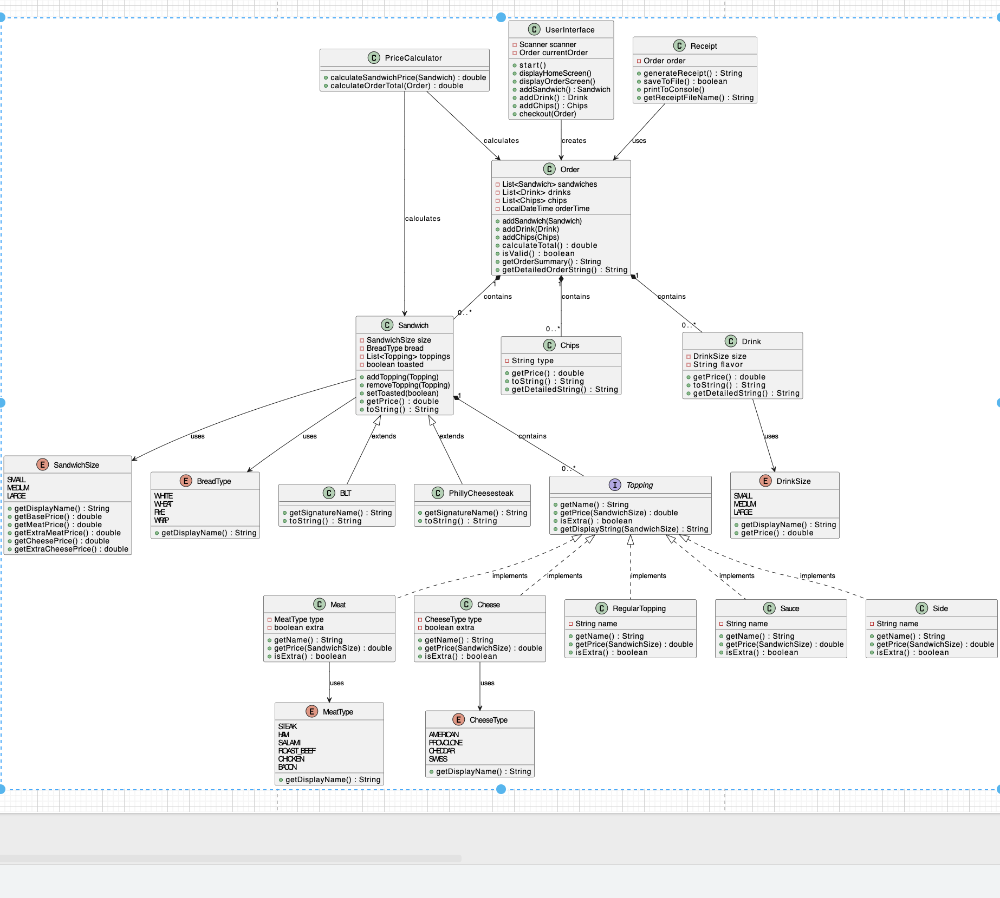

# Yearo Gyro 

this is a subway style deli "gyro" was just the first sandwich thing i thought of that rhymes with yearup
it is still a generic deli.

Yearo Gyro is a console-based ordering system that allows customers to:

-Build custom sandwiches with multiple sizes, bread types and toppings

-Order from signature sandwich menu (BLT, Philly Cheese Steak)

-Customize signature sandwiches by adding or removing toppings

-Add drinks and chips to their order

-View itemized order summaries with pricing

-Generate timestamped receipts saved to disk

## Features
### Sandwich Customization:

-Three sizes: 4", 8", and 12"

-Four bread types: White, Wheat, Rye, Wrap

-Premium toppings: 6 meat options and 4 cheese options (with "extra" pricing)

-Free toppings: 9 vegetable options, 7 sauce options, and side options

-Toast option: Choose to toast your sandwich

-Remove toppings: Support for removing multiple toppings at once

### Signature Sandwiches

-BLT: 8" white bread, bacon, cheddar, lettuce, tomato, ranch (toasted)

-Philly Cheese Steak: 8" white bread, steak, american cheese, peppers, mayo (toasted)

-Full customization: Add or remove any toppings from signature sandwiches

### Order Management

Add multiple sandwiches, drinks, and chips to a single order
Real-time price calculation
Order validation (prevents empty orders)
Detailed order summary before checkout
Support for orders with no sandwiches (drinks/chips only)

### Receipt Generation

Professional formatted receipts with box borders
Automatic receipt creation with detailed order breakdown
Receipts saved with timestamp format: yyyyMMdd-HHmmss.txt
Stored in receipts/ folder
Display-friendly date format on receipts

### Enhanced UI

ASCII art banner with "Yearo Gyro" branding
Color-coded messages 
Box-bordered menus for professional appearance

### Notable Code

Pricing handled with Enums. Using enums in the order creation where each option was an enum saved tremendous amount of
coding and time. Instead of individually checking for conditions for pricing, having an enum for sandwich sizes kept
everything in order. All the calculations were done in one place so there is little room for error. This small change 
also allows for an easy way to introduce other sizes as well. Instead of manually changing information in other areas 
and using if statements to change topping prices, extra topping prices etc., all changes needed are made in one line.

Here's the UML:

